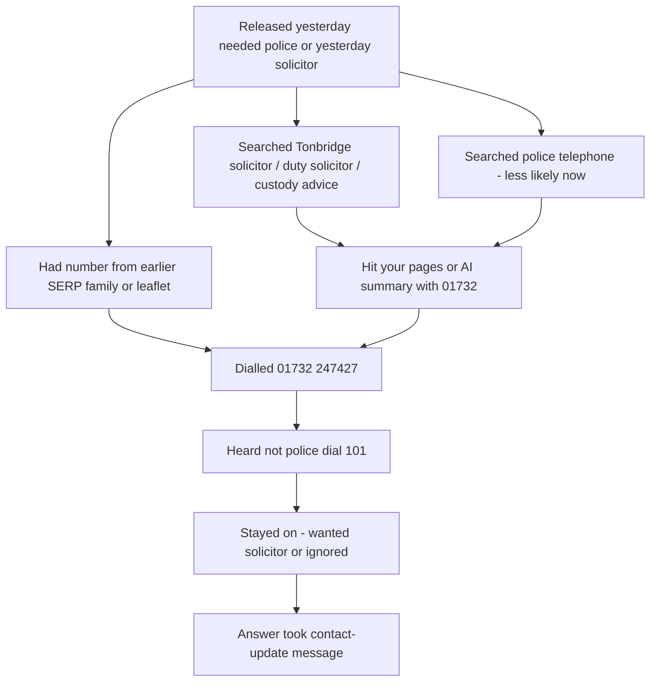

# Call source trace — 24 Jul 2026

Investigation of how a non-client (Christopher John De Rusett) could have obtained `01732 247427` believing it was **the police** or **the solicitor who acted yesterday**.

Answer.co.uk message context: arrested yesterday, phone seized, updating contact number; not Robert Cashman’s client; Answer always labels “Call For? Robert Cashman” because he is the only account contact. Callers hear a pre-answer recording (not the police → dial 101) before Answer takes the message.

## Method

Public checks only (no access to the caller’s device or Google click logs):

1. Web search for police-directory queries
2. Web search for solicitor / Tonbridge custody queries
3. Reverse search for `"01732 247427"` and `"07535 494446"`
4. Live HTML fetch of high-risk Tonbridge URLs
5. Compare live HTML vs search-index excerpts (stale snippet check)

AI Overview / Copilot UIs were not opened in a browser; search-engine **synthesis** of the same queries was used as a proxy for how AI answers summarise the indexed web.

## Findings

### A. Pure “police telephone number” queries — mostly fixed

| Query | Your number in top synthesis? | What ranks instead |
|---|---|---|
| `Tonbridge Police Station telephone number` | **No** | policestationreps.com, police-uk.org → **101 / 01622 690690** |
| `Tonbridge Police Station phone number` | **No** | Apple Maps / Waze / local pages → **01622 690690** |
| `Tonbridge custody telephone number` | **Mixed** | Custody often “not published”; your `/police-station-rep-tonbridge` still appears and **search excerpts still show Call/Text digits** |

**Verdict:** Someone searching only for “Tonbridge Police Station telephone number” is less likely to be handed `01732 247427` than before. That path is weaker for this misdirect than solicitor/custody-adjacent search.

### B. Solicitor / “who dealt with me at Tonbridge” queries — strong leak

| Query / check | Result |
|---|---|
| `Tonbridge Police Station solicitor` | Your pages dominate. Titles like **“Tonbridge Police Station Solicitor \| Robert Cashman…”**. Synthesis states call **01732 247427** / text **07535 494446** for Tonbridge custody help. |
| `What is the phone number for Tonbridge Police Station solicitor Robert Cashman` | Synthesis answers **01732 247427** (and SMS), citing your Tonbridge URLs. |
| Reverse `"01732 247427"` | Almost entirely your site: `/contact`, free-advice, emergency, services, family-instruct blogs — framed as **custody / duty solicitor**, not Kent Police. |

**Verdict:** A person released yesterday who Googled along the lines of “Tonbridge police station solicitor”, “duty solicitor Tonbridge”, or “solicitor Tonbridge custody” would very plausibly get **your number** and believe it belonged to **the solicitor who deals with Tonbridge / who acted yesterday** — even if another firm actually attended.

That matches your reading of the Answer message better than a pure “I want the police switchboard” story.

### C. Live site vs search index (stale + remaining leaks)

| URL | Live (24 Jul 2026) | Still in search excerpts |
|---|---|---|
| `/tonbridge-police-station` | **308** → `/police-station-rep-tonbridge` | Old title + **Call/SMS digits** still cited by search |
| `/police-station-rep-tonbridge` | Title/meta: independent solicitor, **not Kent Police**, 101/999. Visible CTAs push `/contact`. **Digits still present** in RSC payload (`tel:01732247427`, “Call 01732 247427”, aria-labels) | Search still excerpts Call/Text digits |
| `/blog/tonbridge-police-station-custody-and-interviews` | **Live body still shows** Call 01732 / Text 07535 repeatedly next to “Tonbridge custody” | Same in search |
| `/contact`, home, emergency, free-advice | Digits intentional | Digits intentional |

**Verdict:** Remediation improved the primary Tonbridge cover page and pure police-phone SERPs, but:

1. Google/Bing still quote **pre-redirect / pre-hide** content for `/tonbridge-police-station`.
2. The Tonbridge **blog** still publishes digits next to station language (live).
3. The Tonbridge **rep** page still embeds voice digits in client JS/aria even when the visible UI prefers Contact.

Any of those can feed AI summaries and SERP snippets that hand callers `01732 247427` under a “Tonbridge Police Station …” heading.

### D. Paths that remain plausible for this caller

**Most likely:** solicitor/custody Google (or AI summary of your Tonbridge pages) → dialled your number as “the Tonbridge solicitor”.  
**Less likely now:** pure police-directory SERP (those currently push 101/01622).  
**Still possible:** old saved snippet, family Google, or third-party share of a page that still shows digits.

Cannot prove which path *he* used without Answer’s fuller notes / him saying how he found the number.

## What we could not check from here

- His exact Google SERP / AI Overview screenshot at call time
- GSC query impressions / click data (needs your Search Console login)
- Answer.co.uk full transcript / recording
- Whether custody staff or another firm accidentally gave/wrote your number

## Recommended next actions

1. **GSC (you):** URL Inspection + Request indexing for `/police-station-rep-tonbridge`, the 308 from `/tonbridge-police-station`, and the Tonbridge blog. See `reports/google-search-console-actions.md`.
2. **Site follow-up (code):** Strip remaining `tel:` / visible digits from Tonbridge blog CTAs and from RSC payload on high-risk local covers (keep digits on `/contact` only), matching the hybrid phone policy.
3. **Answer.co.uk:** Ask receptionists to note *how the caller got the number* and tag **wrong solicitor vs police misdirect**.
4. **Optional:** Incognito screenshot pack of the query list in this report for your records (UK IP).

## Bottom line

Public search checks show a clear mechanism: **solicitor/Tonbridge custody queries and AI-style summaries still present `01732 247427` beside “Tonbridge Police Station” language**, while pure “police telephone number” queries mostly no longer do. For a non-client updating a contact after yesterday’s arrest, the strongest explanation is he treated your number as **yesterday’s / the Tonbridge solicitor**, not that Google is still handing him the Kent Police switchboard.
